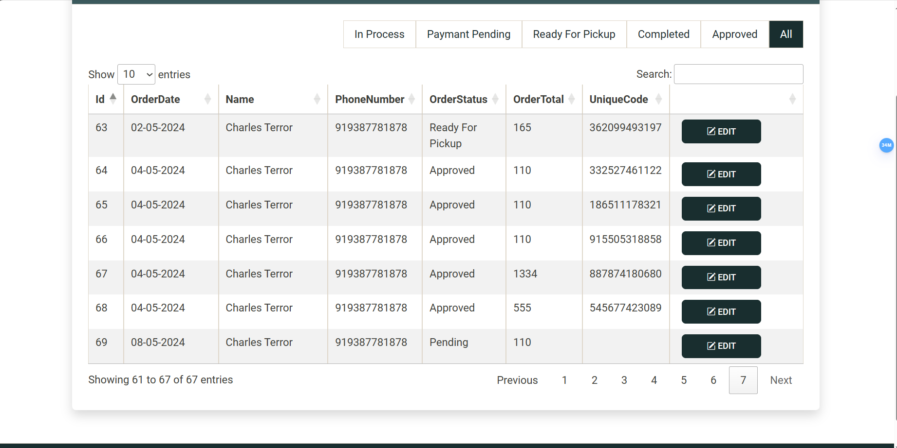

# ASP.NET Core Milk Distribution Website

This is a dynamic ASP.NET Core MVC website designed to streamline the distribution of milk products.

### Index Page

### Multi-step Registration is made possible using TempData.

### The "Buy" or "Add to Cart" button is only visible during farm operational hours.

### The website is crafted with Bootstrap 5 and JavaScript for seamless, real-time updates without page reloads.

### Email Confirmation
Users, excluding administrators, must confirm their email addresses before accessing the site. Otherwise, they will continuously encounter the "RegisterConfirmation" view.

### Stripe is used for efficient and secure Payment transactions.

### Integrated PostMark API for email delivery

### Customer Identification
A unique 12-digit secret key is issued to each customer upon order placement for identification purposes.

### Order Management
Implemented separate order management for both customers and employees/Admins.

### Stock Management
Purchased items are decremented from the available total stock.

Shopping cart contents are reset if accessed outside operational hours or if items are out of stock.

The system automatically updates product status to out of stock if no item stock is detected after an order is placed.

### Security Measures
Security measures are implemented to prevent unauthorized access, including attempts to bypass the website's normal flow of operations.